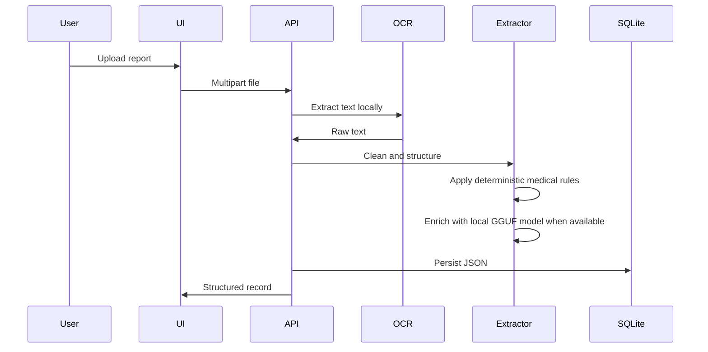

# AI Workflow

## Risk Logic

- Hemoglobin below 12: `Possible Anemia`
- Glucose at or above 126: `High Glucose`
- Cholesterol at or above 200: `High Cholesterol`
- Blood pressure at or above 140/90: `Elevated Blood Pressure`

The recommendation is a triage message and is not a diagnosis.
