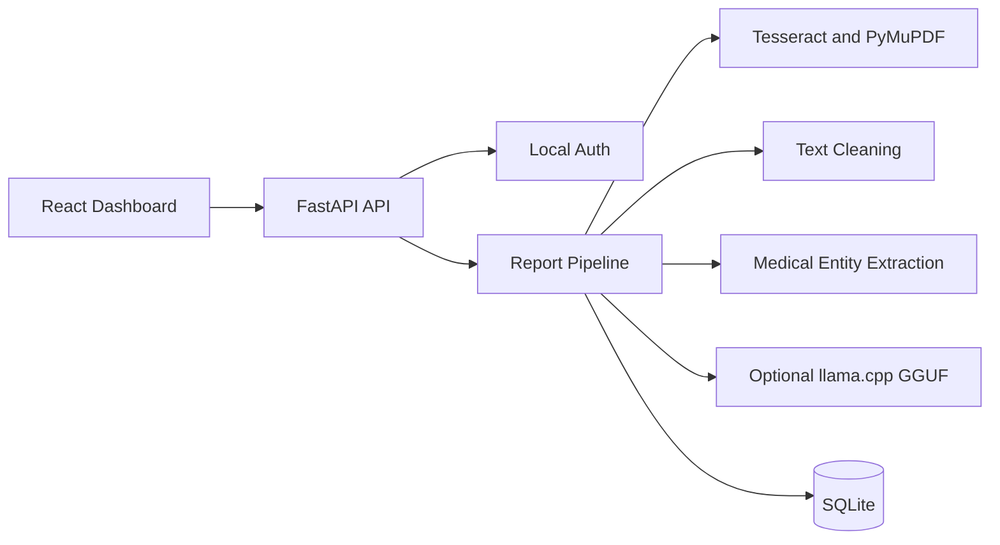

# Architecture

## Backend

The backend uses clean service boundaries:

- `api`: HTTP routes and validation.
- `services`: OCR, cleaning, extraction, local model orchestration.
- `repositories`: SQLite persistence.
- `schemas`: API data contracts.
- `core`: configuration and security.

## Frontend

The frontend is a Vite React application with reusable API, theme, login, dashboard, upload, history, report viewer, and JSON viewer components.

## Offline AI

Deterministic extraction guarantees useful offline behavior. If a local GGUF model exists and `llama-cpp-python` is installed, llama.cpp is used to enrich structured extraction locally on CPU.
