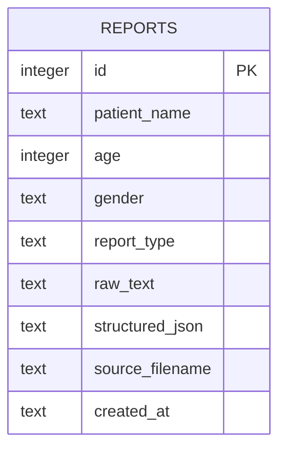

# Database

SQLite file: `backend/database/mediscan.sqlite3`

## Table: `reports`

| Column | Type | Description |
| --- | --- | --- |
| `id` | integer | Primary key |
| `patient_name` | text | Extracted patient name |
| `age` | integer | Extracted age |
| `gender` | text | Extracted gender |
| `report_type` | text | Blood Report, Prescription, or ECG Report |
| `raw_text` | text | Cleaned OCR text |
| `structured_json` | text | JSON output |
| `source_filename` | text | Uploaded file name |
| `created_at` | text | Local creation timestamp |
